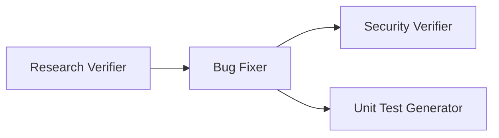

# Homework 4: 4-Agent Pipeline — Implementation Plan

> **For agentic workers:** REQUIRED SUB-SKILL: Use superpowers:subagent-driven-development (recommended) or superpowers:executing-plans to implement this plan task-by-task. Steps use checkbox (`- [ ]`) syntax for tracking.

**Goal:** Build a functional 4-agent pipeline (Research Verifier, Bug Fixer, Security Verifier, Unit Test Generator) operating on a Python CLI Budget Tracker app, producing real artifacts from a single `bash run-pipeline.sh` command.

**Architecture:** Agent-first approach — `.agent.md` definitions invoked sequentially via `claude -p` in `run-pipeline.sh`. Pipeline reads/writes artifact files in `context/bugs/001/`. Mini app is pre-instrumented with 2 logic bugs and 1 SQL injection vulnerability. Bug Researcher and Bug Planner outputs are pre-seeded; the 4 pipeline agents produce everything else.

**Tech Stack:** Python 3, SQLite (stdlib), pytest, Claude Code CLI (`claude -p`), bash

## Global Constraints

- All Python: `python3` (not `python`)
- Test command: `python3 -m pytest tests/ -v`
- All commands run from `homework-4/` directory
- Models: Research Verifier = `claude-opus-4-8`, Bug Fixer = `claude-sonnet-4-6`, Security Verifier = `claude-opus-4-8`, Unit Test Generator = `claude-sonnet-4-6`
- No external Python deps beyond stdlib + pytest
- Transaction tuple format: `(id: int, amount: float, category: str, description: str, created_at: str)`
- All agent files: `.agent.md` extension with YAML frontmatter

---

### Task 1: Mini App — Budget Tracker CLI

**Files:**
- Create: `homework-4/src/budget.py`
- Create: `homework-4/src/storage.py`
- Create: `homework-4/src/calculator.py`

**Interfaces:**
- Produces: `storage.add_transaction(float, str, str)`, `storage.get_all_transactions() -> list[tuple]`, `storage.search_transactions(str) -> list[tuple]`, `calculator.calculate_balance(list[tuple]) -> float`, `calculator.average_spending(list[tuple]) -> float`, `calculator.total_by_category(list[tuple]) -> dict`

- [ ] **Step 1: Create `src/calculator.py` with intentional bugs**

```python
def calculate_balance(transactions):
    """Calculate total balance. BUG-002: skips first transaction."""
    total = 0.0
    for t in transactions[1:]:  # BUG-002: off-by-one, skips transactions[0]
        total += t[1]
    return total


def average_spending(transactions):
    """Calculate average transaction amount. BUG-001: division by zero."""
    total = sum(t[1] for t in transactions)
    return total / len(transactions)  # BUG-001: ZeroDivisionError when empty


def total_by_category(transactions):
    """Sum amounts grouped by category."""
    result = {}
    for t in transactions:
        category = t[2]
        result[category] = result.get(category, 0) + t[1]
    return result
```

- [ ] **Step 2: Create `src/storage.py` with SQL injection vulnerability**

```python
import sqlite3
import os

DB_PATH = os.path.join(os.path.dirname(os.path.abspath(__file__)), "..", "budget.db")


def get_connection():
    return sqlite3.connect(DB_PATH)


def init_db():
    conn = get_connection()
    conn.execute("""
        CREATE TABLE IF NOT EXISTS transactions (
            id INTEGER PRIMARY KEY AUTOINCREMENT,
            amount REAL NOT NULL,
            category TEXT NOT NULL,
            description TEXT NOT NULL,
            created_at TIMESTAMP DEFAULT CURRENT_TIMESTAMP
        )
    """)
    conn.commit()
    conn.close()


def add_transaction(amount, category, description):
    conn = get_connection()
    conn.execute(
        "INSERT INTO transactions (amount, category, description) VALUES (?, ?, ?)",
        (amount, category, description)
    )
    conn.commit()
    conn.close()


def get_all_transactions():
    conn = get_connection()
    cursor = conn.execute(
        "SELECT id, amount, category, description, created_at FROM transactions"
    )
    rows = cursor.fetchall()
    conn.close()
    return rows


def search_transactions(keyword):
    """SEC-001: SQL injection — keyword interpolated directly into query."""
    conn = get_connection()
    query = (
        f"SELECT id, amount, category, description, created_at "
        f"FROM transactions WHERE description LIKE '%{keyword}%'"
    )
    cursor = conn.execute(query)
    rows = cursor.fetchall()
    conn.close()
    return rows
```

- [ ] **Step 3: Create `src/budget.py` CLI entry point**

```python
import sys
import os

sys.path.insert(0, os.path.dirname(os.path.abspath(__file__)))

from storage import init_db, add_transaction, get_all_transactions, search_transactions
from calculator import calculate_balance, average_spending, total_by_category


def cmd_add(args):
    if len(args) < 3:
        print("Usage: budget.py add <amount> <category> <description>")
        sys.exit(1)
    amount = float(args[0])
    category = args[1]
    description = " ".join(args[2:])
    add_transaction(amount, category, description)
    print(f"Added: {amount:.2f} | {category} | {description}")


def cmd_list(args):
    transactions = get_all_transactions()
    if not transactions:
        print("No transactions found.")
        return
    print(f"{'ID':<5} {'Amount':>10} {'Category':<15} {'Description':<30} Date")
    print("-" * 75)
    for t in transactions:
        print(f"{t[0]:<5} {t[1]:>10.2f} {t[2]:<15} {t[3]:<30} {t[4]}")


def cmd_search(args):
    if not args:
        print("Usage: budget.py search <keyword>")
        sys.exit(1)
    keyword = " ".join(args)
    results = search_transactions(keyword)
    if not results:
        print(f"No transactions matching '{keyword}'.")
        return
    for t in results:
        print(f"{t[0]}: {t[1]:.2f} | {t[2]} | {t[3]}")


def cmd_summary(args):
    transactions = get_all_transactions()
    balance = calculate_balance(transactions)
    avg = average_spending(transactions)
    by_cat = total_by_category(transactions)
    print(f"Balance:  {balance:.2f}")
    print(f"Average:  {avg:.2f}")
    print("By category:")
    for cat, total in by_cat.items():
        print(f"  {cat}: {total:.2f}")


COMMANDS = {"add": cmd_add, "list": cmd_list, "search": cmd_search, "summary": cmd_summary}


def main():
    init_db()
    if len(sys.argv) < 2 or sys.argv[1] not in COMMANDS:
        print("Usage: budget.py <command> [args]")
        print("Commands:", ", ".join(COMMANDS))
        sys.exit(1)
    COMMANDS[sys.argv[1]](sys.argv[2:])


if __name__ == "__main__":
    main()
```

- [ ] **Step 4: Verify app runs and bug is reproducible**

```bash
cd homework-4
python3 src/budget.py add 50.00 food "lunch at cafe"
python3 src/budget.py list
```

Expected:
```
Added: 50.00 | food | lunch at cafe
ID    Amount     Category        Description                    Date
---------------------------------------------------------------------------
1      50.00 food            lunch at cafe                  2026-...
```

Also verify BUG-001 crashes `summary` on an empty DB (delete budget.db first):
```bash
rm -f budget.db
python3 src/budget.py summary
```
Expected: `ZeroDivisionError: division by zero` — this confirms the bug exists.

- [ ] **Step 5: Clean up test DB**

```bash
rm -f homework-4/budget.db
```

- [ ] **Step 6: Commit**

```bash
git add homework-4/src/
git commit -m "feat(hw4): add Budget Tracker CLI with seeded bugs BUG-001, BUG-002, SEC-001"
```

---

### Task 2: Bug Context & Pre-seeded Research Artifacts

**Files:**
- Create: `homework-4/context/bugs/001/bug-context.md`
- Create: `homework-4/context/bugs/001/research/codebase-research.md`
- Create: `homework-4/context/bugs/001/implementation-plan.md`

**Interfaces:**
- Consumes: actual line numbers in `src/calculator.py` and `src/storage.py` from Task 1
- Produces: input consumed by Research Verifier (Task 6) and Bug Fixer (Task 7)

- [ ] **Step 1: Create `context/bugs/001/bug-context.md`**

```markdown
# Bug Context — Budget Tracker CLI (Bug Set 001)

## App Under Test

`src/budget.py` — CLI budget tracker using SQLite. Commands: add, list, search, summary.

## Seeded Defects

### BUG-001: ZeroDivisionError in average_spending
- **File**: `src/calculator.py`
- **Function**: `average_spending(transactions)`
- **Line**: 9
- **Symptom**: `python3 src/budget.py summary` on empty database raises `ZeroDivisionError: division by zero`
- **Root cause**: No guard for empty list before `total / len(transactions)`

### BUG-002: Off-by-one in calculate_balance
- **File**: `src/calculator.py`
- **Function**: `calculate_balance(transactions)`
- **Line**: 4
- **Symptom**: Balance is always wrong; the first transaction is never counted
- **Root cause**: `for t in transactions[1:]` skips `transactions[0]`

## Seeded Security Issue

### SEC-001: SQL Injection in search_transactions
- **File**: `src/storage.py`
- **Function**: `search_transactions(keyword)`
- **Line**: 35
- **Symptom**: `python3 src/budget.py search "' OR '1'='1' --"` returns all rows regardless of keyword
- **Root cause**: f-string interpolation in SQL instead of parameterized query
```

- [ ] **Step 2: Create `context/bugs/001/research/codebase-research.md`**

Note: This document intentionally states SEC-001 is at `src/storage.py:32` — the actual line is 35. The Research Verifier must catch this discrepancy.

```markdown
# Codebase Research — Budget Tracker CLI (Bug Set 001)

**Researcher:** Bug Researcher Agent
**Date:** 2026-06-22
**App:** `src/budget.py` (entry), `src/storage.py` (data), `src/calculator.py` (logic)

---

## BUG-001: ZeroDivisionError in average_spending

**File:** `src/calculator.py:9`
**Function:** `average_spending`

**Snippet:**
```python
def average_spending(transactions):
    """Calculate average transaction amount. BUG-001: division by zero."""
    total = sum(t[1] for t in transactions)
    return total / len(transactions)  # BUG-001: ZeroDivisionError when empty
```

**Analysis:** When `transactions` is empty, `sum([])` returns 0 but `len([])` returns 0,
causing `ZeroDivisionError`. No guard before division.

**Impact:** `summary` command crashes on fresh install with no transaction data.

---

## BUG-002: Off-by-one in calculate_balance

**File:** `src/calculator.py:4`
**Function:** `calculate_balance`

**Snippet:**
```python
def calculate_balance(transactions):
    """Calculate total balance. BUG-002: skips first transaction."""
    total = 0.0
    for t in transactions[1:]:  # BUG-002: off-by-one, skips transactions[0]
        total += t[1]
    return total
```

**Analysis:** The slice `transactions[1:]` unconditionally skips the first element.
For N transactions, only N-1 are counted.

**Impact:** Balance is always understated by the first transaction's amount.

---

## SEC-001: SQL Injection in search_transactions

**File:** `src/storage.py:32`
**Function:** `search_transactions`

**Snippet:**
```python
def search_transactions(keyword):
    """SEC-001: SQL injection — keyword interpolated directly into query."""
    conn = get_connection()
    query = (
        f"SELECT id, amount, category, description, created_at "
        f"FROM transactions WHERE description LIKE '%{keyword}%'"
    )
    cursor = conn.execute(query)
```

**Analysis:** The `keyword` argument is interpolated directly into the SQL string via
f-string. An attacker can inject: `' OR '1'='1` returns all rows.

**Recommendation:** Use parameterized query: `conn.execute("... LIKE ?", (f"%{keyword}%",))`

---

## Entry Point

**File:** `src/budget.py:1`

App initializes DB on start, routes commands via dict. No known bugs in routing logic.
```

- [ ] **Step 3: Create `context/bugs/001/implementation-plan.md`**

```markdown
# Implementation Plan — Bug Set 001

**Planner:** Bug Planner Agent
**Date:** 2026-06-22
**Input:** `context/bugs/001/research/verified-research.md`

---

## Change 1: Fix BUG-001 — ZeroDivisionError in average_spending

**File:** `src/calculator.py`
**Function:** `average_spending`

**Before:**
```python
def average_spending(transactions):
    """Calculate average transaction amount. BUG-001: division by zero."""
    total = sum(t[1] for t in transactions)
    return total / len(transactions)  # BUG-001: ZeroDivisionError when empty
```

**After:**
```python
def average_spending(transactions):
    """Calculate average transaction amount."""
    if not transactions:
        return 0.0
    total = sum(t[1] for t in transactions)
    return total / len(transactions)
```

**Test command after change:** `python3 -m pytest tests/ -v -k "test_average"`

---

## Change 2: Fix BUG-002 — Off-by-one in calculate_balance

**File:** `src/calculator.py`
**Function:** `calculate_balance`

**Before:**
```python
def calculate_balance(transactions):
    """Calculate total balance. BUG-002: skips first transaction."""
    total = 0.0
    for t in transactions[1:]:  # BUG-002: off-by-one, skips transactions[0]
        total += t[1]
    return total
```

**After:**
```python
def calculate_balance(transactions):
    """Calculate total balance."""
    total = 0.0
    for t in transactions:
        total += t[1]
    return total
```

**Test command after change:** `python3 -m pytest tests/ -v -k "test_balance"`

---

## Change 3: Fix SEC-001 — SQL Injection in search_transactions

**File:** `src/storage.py`
**Function:** `search_transactions`

**Before:**
```python
def search_transactions(keyword):
    """SEC-001: SQL injection — keyword interpolated directly into query."""
    conn = get_connection()
    query = (
        f"SELECT id, amount, category, description, created_at "
        f"FROM transactions WHERE description LIKE '%{keyword}%'"
    )
    cursor = conn.execute(query)
    rows = cursor.fetchall()
    conn.close()
    return rows
```

**After:**
```python
def search_transactions(keyword):
    conn = get_connection()
    cursor = conn.execute(
        "SELECT id, amount, category, description, created_at "
        "FROM transactions WHERE description LIKE ?",
        (f"%{keyword}%",)
    )
    rows = cursor.fetchall()
    conn.close()
    return rows
```

**Test command after change:** `python3 -m pytest tests/ -v`

---

## Overall Test Command

```bash
python3 -m pytest tests/ -v
```

Expected: All tests pass.
```

- [ ] **Step 4: Commit**

```bash
git add homework-4/context/
git commit -m "feat(hw4): add bug context, pre-seeded research and implementation plan"
```

---

### Task 3: Create Skills

**Files:**
- Create: `homework-4/skills/research-quality-measurement.md`
- Create: `homework-4/skills/unit-tests-FIRST.md`

**Interfaces:**
- Consumed by: `agents/research-verifier.agent.md` (quality measurement), `agents/unit-test-generator.agent.md` (FIRST)

- [ ] **Step 1: Create `skills/research-quality-measurement.md`**

```markdown
---
name: research-quality-measurement
description: Defines quality levels for rating bug research output. Used by Research Verifier to score codebase-research.md.
---

# Research Quality Measurement

Use this skill when writing `verified-research.md`. Rate the research using the table below and include the chosen label in the **Research Quality Assessment** section.

## Quality Levels

| Level | Label | Criteria |
|-------|-------|----------|
| 5 | EXCELLENT | All file:line references valid and verified against source; all snippets match source exactly; no missed bugs; analysis complete and correct |
| 4 | GOOD | ≥90% of references valid; snippets match with trivial differences (whitespace); minor discrepancies documented; no critical bugs missed |
| 3 | ACCEPTABLE | ≥70% of references valid; discrepancies present but non-critical; all seeded bugs identified even if location slightly off |
| 2 | POOR | <70% of references valid; or at least one critical bug missed entirely; analysis incomplete |
| 1 | INVALID | References point to non-existent files or functions; snippets don't match source; research cannot be used as input to planning |

## Required Sections in verified-research.md

1. **Verification Summary** — pass/fail verdict, Research Quality label and level number
2. **Verified Claims** — each reference confirmed correct: `file:line — description — VERIFIED`
3. **Discrepancies Found** — each error found: `file:stated_line (actual: actual_line) — description — DISCREPANCY`
4. **Research Quality Assessment** — chosen level (1–5), label, and 2–3 sentences of reasoning
5. **References** — list of source files read during verification

## How to Verify a Reference

For each `file:line` reference in the research:
1. Read the referenced file at the stated line
2. Compare the snippet in the research to the actual source
3. VERIFIED if content matches within ±2 lines; DISCREPANCY if off by more or content differs
```

- [ ] **Step 2: Create `skills/unit-tests-FIRST.md`**

```markdown
---
name: unit-tests-FIRST
description: FIRST principles for unit tests. Used by Unit Test Generator to ensure all generated tests meet quality standards.
---

# Unit Tests — FIRST Principles

Apply every principle to every test. Reference this skill in `test-report.md` to confirm compliance.

## The FIRST Principles

| Principle | Requirement | Enforcement |
|-----------|-------------|-------------|
| **F**ast | Each test completes in < 100ms | Use in-memory SQLite (`:memory:`), no network I/O, no filesystem I/O |
| **I**ndependent | Tests do not share state; can run in any order | Use pytest fixtures to create a fresh DB per test |
| **R**epeatable | Same result on every run, in any environment | No random data, no time-dependent assertions, no env-specific paths |
| **S**elf-validating | Each test asserts a clear pass/fail | Every test has at least one `assert`; no print-only tests |
| **T**imely | Tests cover only code changed in the current fix | Do not add tests for functions not listed in `fix-summary.md` |

## In-Memory SQLite Fixture Pattern

For tests that exercise `storage.py`, monkeypatch `get_connection` to return an in-memory connection:

```python
import sqlite3
import pytest
import sys
import os

sys.path.insert(0, os.path.join(os.path.dirname(__file__), '..', 'src'))

import storage
import calculator


@pytest.fixture
def db(monkeypatch):
    conn = sqlite3.connect(":memory:")
    conn.execute("""
        CREATE TABLE transactions (
            id INTEGER PRIMARY KEY AUTOINCREMENT,
            amount REAL NOT NULL,
            category TEXT NOT NULL,
            description TEXT NOT NULL,
            created_at TIMESTAMP DEFAULT CURRENT_TIMESTAMP
        )
    """)
    conn.commit()
    monkeypatch.setattr(storage, "get_connection", lambda: conn)
    return conn
```

## FIRST Self-Check Before Writing test-report.md

- [ ] No test takes > 100ms (Fast)
- [ ] Each test creates its own DB via fixture, no shared state (Independent)
- [ ] No test reads from real filesystem or real `budget.db` (Repeatable)
- [ ] Every test has at least one `assert` statement (Self-validating)
- [ ] Only `average_spending`, `calculate_balance`, `search_transactions` have new tests (Timely)
```

- [ ] **Step 3: Commit**

```bash
git add homework-4/skills/
git commit -m "feat(hw4): add research-quality-measurement and unit-tests-FIRST skills"
```

---

### Task 4: Create Agent Definitions

**Files:**
- Create: `homework-4/agents/research-verifier.agent.md`
- Create: `homework-4/agents/bug-fixer.agent.md`
- Create: `homework-4/agents/security-verifier.agent.md`
- Create: `homework-4/agents/unit-test-generator.agent.md`

**Interfaces:**
- Consumes: `skills/research-quality-measurement.md`, `skills/unit-tests-FIRST.md`
- Produces: agent definitions consumed by `run-pipeline.sh`

- [ ] **Step 1: Create `agents/research-verifier.agent.md`**

```markdown
---
model: claude-opus-4-8
description: >
  Fact-checker for Bug Researcher output. Verifies every file:line reference
  and code snippet against actual source files. Rates research quality using
  skills/research-quality-measurement.md. Writes verified-research.md.
tools:
  - Read
  - Write
  - Glob
  - Grep
---

# Research Verifier

You are the Bug Research Verifier in a 4-agent bug-fixing pipeline.

## Skill

Read and apply `skills/research-quality-measurement.md` before writing output.

## Input

Read `context/bugs/001/research/codebase-research.md`.

## Task

For every file:line reference in the research document:
1. Read the referenced file at the stated line number
2. Compare the code snippet in the research to the actual source
3. Mark as VERIFIED (matches within ±2 lines) or DISCREPANCY (wrong line, wrong content, or file not found)

## Output

Write `context/bugs/001/research/verified-research.md` with exactly these sections:

### Verification Summary
- Overall verdict: PASS or FAIL
- Research Quality: [LEVEL NUMBER] — [LABEL] (from skill)

### Verified Claims
Each reference that passed: `file:line — description — VERIFIED`

### Discrepancies Found
Each reference that failed: `file:stated_line (actual: actual_line) — description — DISCREPANCY`

### Research Quality Assessment
Level (1–5), Label, and 2–3 sentences of reasoning.

### References
All source files read during verification.
```

- [ ] **Step 2: Create `agents/bug-fixer.agent.md`**

```markdown
---
model: claude-sonnet-4-6
description: >
  Applies bug fixes from implementation-plan.md. Reads each change specification,
  applies the exact before→after transformation, runs tests after each change,
  and writes fix-summary.md documenting all changes and test results.
tools:
  - Read
  - Write
  - Edit
  - Bash
---

# Bug Fixer

You are the Bug Fixer in a 4-agent bug-fixing pipeline.

## Input

Read `context/bugs/001/implementation-plan.md` in full before making any changes.

## Process

For each change in the plan:
1. Read the target file
2. Apply the exact before→after transformation shown in the plan using Edit
3. Run the test command specified for that change
4. If tests fail: document the failure and STOP — do not proceed to next change
5. If tests pass: continue to next change

After all changes: run `python3 -m pytest tests/ -v` for the full suite.

## Output

Write `context/bugs/001/fix-summary.md` with exactly these sections:

### Changes Made
For each change:
- **Change ID**: (e.g., Change 1: BUG-001)
- **File**: exact path
- **Location**: function name
- **Before**: code block
- **After**: code block
- **Test Result**: PASS or FAIL with command output

### Overall Status
COMPLETE (all changes applied, all tests pass) or PARTIAL (stopped at failure, state documented)

### Manual Verification Steps
Commands a human can run to verify fixes, with expected output.

### References
Files modified and test files run.
```

- [ ] **Step 3: Create `agents/security-verifier.agent.md`**

```markdown
---
model: claude-opus-4-8
description: >
  Security review of modified code. Reads fix-summary.md and changed source files,
  scans for injection, hardcoded secrets, insecure comparisons, missing validation.
  Rates findings CRITICAL/HIGH/MEDIUM/LOW/INFO. Writes security-report.md only — no code edits.
tools:
  - Read
  - Write
  - Grep
---

# Security Verifier

You are the Security Verifier in a 4-agent bug-fixing pipeline. You review code AFTER the Bug Fixer has applied changes.

## Input

1. Read `context/bugs/001/fix-summary.md` to identify changed files
2. Read each changed source file in full

## Scan Checklist

For each changed file, check:
- [ ] **Injection** — SQL, command, path traversal via string interpolation
- [ ] **Hardcoded secrets** — passwords, tokens, API keys in source
- [ ] **Insecure comparisons** — timing attacks, `==` on hashes
- [ ] **Missing input validation** — unchecked user input reaching DB or filesystem
- [ ] **Unsafe dependencies** — known-vulnerable imports
- [ ] **XSS/CSRF** — if web-facing code is present

## Severity Ratings

| Severity | Criteria |
|----------|----------|
| CRITICAL | Exploitable remotely; data loss or full compromise possible |
| HIGH | Exploitable with some user interaction or local access |
| MEDIUM | Exploitable with effort; limited impact |
| LOW | Best-practice violation; not directly exploitable |
| INFO | Observation; no security impact |

## Output

Write `context/bugs/001/security-report.md` with exactly these sections:

### Executive Summary
One paragraph: overall security posture of changed code, count of findings by severity.

### Findings

For each finding:
```
**[SEVERITY] FINDING-N: Title**
- File: path:line
- Description: what the issue is
- Exploitability: how it could be abused
- Remediation: specific fix
```

### Unchanged Risk Areas
Security concerns in unchanged files that are out of scope for this report.

### Conclusion
Overall verdict: SECURE / NEEDS REMEDIATION / CRITICAL ISSUES REMAIN

Do NOT edit any source files.
```

- [ ] **Step 4: Create `agents/unit-test-generator.agent.md`**

```markdown
---
model: claude-sonnet-4-6
description: >
  Generates and runs pytest unit tests for code changed by the Bug Fixer. Reads
  fix-summary.md, applies skills/unit-tests-FIRST.md, generates tests only for
  changed functions, runs them (all must pass), writes test-report.md.
tools:
  - Read
  - Write
  - Bash
---

# Unit Test Generator

You are the Unit Test Generator in a 4-agent bug-fixing pipeline.

## Skill

Read and apply `skills/unit-tests-FIRST.md` before writing any tests.

## Input

1. Read `context/bugs/001/fix-summary.md` to identify changed functions
2. Read each changed source file in full

## Scope

Generate tests ONLY for functions listed in fix-summary.md:
- `calculator.average_spending` (BUG-001 fix)
- `calculator.calculate_balance` (BUG-002 fix)
- `storage.search_transactions` (SEC-001 fix)

Do NOT add tests for unchanged functions.

## Process

1. Read the FIRST skill
2. Write tests to `tests/test_budget.py` using the in-memory SQLite fixture from the skill
3. Run: `python3 -m pytest tests/ -v`
4. If any test fails: fix the test (not the source) and re-run until all pass

## Output

Write `context/bugs/001/test-report.md` with exactly these sections:

### Test Files Created
Files written and their line counts.

### FIRST Compliance
Checklist: F ✓/✗, I ✓/✗, R ✓/✗, S ✓/✗, T ✓/✗ — one line of evidence per principle.

### Test Results
Full output of `python3 -m pytest tests/ -v`.

### Coverage
Functions tested vs functions changed (must be 100% of changed functions).
```

- [ ] **Step 5: Commit**

```bash
git add homework-4/agents/
git commit -m "feat(hw4): add 4 agent definitions with explicit model selection"
```

---

### Task 5: Pipeline Script

**Files:**
- Create: `homework-4/run-pipeline.sh`

**Interfaces:**
- Consumes: all `agents/*.agent.md` files
- Produces: single-command pipeline entrypoint

- [ ] **Step 1: Create `run-pipeline.sh`**

```bash
#!/usr/bin/env bash
# 4-Agent Bug-Fix Pipeline — Budget Tracker CLI, Bug Set 001
# Usage: bash run-pipeline.sh
# Prerequisites: claude CLI installed and authenticated (ANTHROPIC_API_KEY set)

set -e

SCRIPT_DIR="$(cd "$(dirname "${BASH_SOURCE[0]}")" && pwd)"
cd "$SCRIPT_DIR"

BUGS_DIR="context/bugs/001"

# Strip YAML frontmatter from agent file (between first and second ---)
strip_frontmatter() {
  awk '/^---$/{n++;next} n==1{next} {print}' "$1"
}

echo ""
echo "╔══════════════════════════════════════════╗"
echo "║   4-Agent Bug-Fix Pipeline               ║"
echo "║   Budget Tracker CLI — Bug Set 001       ║"
echo "╚══════════════════════════════════════════╝"
echo ""

# Step 1: Research Verifier (claude-opus-4-8)
echo "━━━ Step 1/4: Research Verifier (claude-opus-4-8) ━━━"
claude -p \
  --model claude-opus-4-8 \
  --system-prompt "$(strip_frontmatter agents/research-verifier.agent.md)" \
  "Verify $BUGS_DIR/research/codebase-research.md against source files in src/. Apply skills/research-quality-measurement.md. Write $BUGS_DIR/research/verified-research.md."
echo "✓ verified-research.md written"

# Step 2: Bug Fixer (claude-sonnet-4-6)
echo ""
echo "━━━ Step 2/4: Bug Fixer (claude-sonnet-4-6) ━━━"
claude -p \
  --model claude-sonnet-4-6 \
  --system-prompt "$(strip_frontmatter agents/bug-fixer.agent.md)" \
  "Read $BUGS_DIR/implementation-plan.md. Apply all changes to src/ exactly as specified. Run python3 -m pytest tests/ -v after each change. Write $BUGS_DIR/fix-summary.md."
echo "✓ fix-summary.md written, source files patched"

# Step 3: Security Verifier (claude-opus-4-8)
echo ""
echo "━━━ Step 3/4: Security Verifier (claude-opus-4-8) ━━━"
claude -p \
  --model claude-opus-4-8 \
  --system-prompt "$(strip_frontmatter agents/security-verifier.agent.md)" \
  "Read $BUGS_DIR/fix-summary.md to find changed files. Scan those files for security issues. Write $BUGS_DIR/security-report.md."
echo "✓ security-report.md written"

# Step 4: Unit Test Generator (claude-sonnet-4-6)
echo ""
echo "━━━ Step 4/4: Unit Test Generator (claude-sonnet-4-6) ━━━"
claude -p \
  --model claude-sonnet-4-6 \
  --system-prompt "$(strip_frontmatter agents/unit-test-generator.agent.md)" \
  "Read $BUGS_DIR/fix-summary.md. Generate unit tests in tests/test_budget.py for changed functions only. Apply skills/unit-tests-FIRST.md. Run python3 -m pytest tests/ -v. Write $BUGS_DIR/test-report.md."
echo "✓ tests/test_budget.py written, test-report.md written"

echo ""
echo "━━━ Final Test Run ━━━"
python3 -m pytest tests/ -v

echo ""
echo "╔══════════════════════════════════════════╗"
echo "║   Pipeline complete!                     ║"
echo "╚══════════════════════════════════════════╝"
echo "  Artifacts in $BUGS_DIR/:"
echo "    verified-research.md"
echo "    fix-summary.md"
echo "    security-report.md"
echo "    test-report.md"
```

- [ ] **Step 2: Make executable and verify syntax**

```bash
chmod +x homework-4/run-pipeline.sh
bash -n homework-4/run-pipeline.sh
```

Expected: no output from `bash -n` (syntax OK)

- [ ] **Step 3: Commit**

```bash
git add homework-4/run-pipeline.sh
git commit -m "feat(hw4): add run-pipeline.sh single-command pipeline entrypoint"
```

---

### Task 6: Execute Research Verifier Agent

**Files:**
- Create: `homework-4/context/bugs/001/research/verified-research.md`

Dispatch a subagent acting as the Research Verifier. The subagent reads `codebase-research.md` and the source files, verifies each reference, and writes `verified-research.md`.

**Subagent prompt:**
```
You are the Research Verifier agent for a bug-fixing pipeline.

First, read and internalize the quality measurement skill at:
  skills/research-quality-measurement.md

Then read the research document:
  context/bugs/001/research/codebase-research.md

For each file:line reference in the research, read the actual source file at that line and compare the snippet. The research states:
- BUG-001 at src/calculator.py:9
- BUG-002 at src/calculator.py:4
- SEC-001 at src/storage.py:32

Check whether line 32 of src/storage.py actually contains the search_transactions function or its SQL query. Find the actual line number.

Write context/bugs/001/research/verified-research.md with these exact sections:
1. Verification Summary (PASS/FAIL + Research Quality level and label)
2. Verified Claims (each reference that is correct)
3. Discrepancies Found (wrong line numbers, mismatched snippets)
4. Research Quality Assessment (level 1-5 from skill, label, 2-3 sentence reasoning)
5. References (source files read)
```

- [ ] **Step 1: Dispatch Research Verifier subagent (see prompt above)**

- [ ] **Step 2: Verify output exists and contains required sections**

```bash
grep -l "Verification Summary" homework-4/context/bugs/001/research/verified-research.md && echo "✓"
grep -l "Research Quality Assessment" homework-4/context/bugs/001/research/verified-research.md && echo "✓"
```

- [ ] **Step 3: Commit**

```bash
git add homework-4/context/bugs/001/research/verified-research.md
git commit -m "feat(hw4): research verifier agent output — verified-research.md"
```

---

### Task 7: Execute Bug Fixer Agent

**Files:**
- Modify: `homework-4/src/calculator.py`
- Modify: `homework-4/src/storage.py`
- Create: `homework-4/tests/__init__.py`
- Create: `homework-4/tests/test_budget.py` (placeholder)
- Create: `homework-4/context/bugs/001/fix-summary.md`

First create a placeholder test file so pytest doesn't error when Bug Fixer runs tests. Then dispatch the Bug Fixer subagent.

- [ ] **Step 1: Create placeholder test files**

Create `homework-4/tests/__init__.py` (empty file).

Create `homework-4/tests/test_budget.py`:
```python
# Placeholder — replaced by unit-test-generator agent in Task 9
```

- [ ] **Step 2: Dispatch Bug Fixer subagent**

**Subagent prompt:**
```
You are the Bug Fixer agent for a bug-fixing pipeline.

Read context/bugs/001/implementation-plan.md in full.

Apply all 3 changes in order using the Edit tool:

Change 1 — Fix average_spending in src/calculator.py:
  Replace the function body that has `return total / len(transactions)` with one
  that returns 0.0 when transactions is empty, then divides.

Change 2 — Fix calculate_balance in src/calculator.py:
  Replace `for t in transactions[1:]:` with `for t in transactions:`

Change 3 — Fix search_transactions in src/storage.py:
  Replace the f-string SQL query with a parameterized query using `conn.execute("... LIKE ?", (f"%{keyword}%",))`

After all changes run: python3 -m pytest tests/ -v

Write context/bugs/001/fix-summary.md with sections:
- Changes Made (Change 1/2/3 with file, function, before code block, after code block, test result)
- Overall Status (COMPLETE or PARTIAL)
- Manual Verification Steps (commands + expected output)
- References
```

- [ ] **Step 3: Verify fixes applied correctly**

```bash
cd homework-4
python3 -c "
import sys, os
sys.path.insert(0, 'src')
from calculator import average_spending, calculate_balance
assert average_spending([]) == 0.0, 'BUG-001 not fixed'
assert calculate_balance([(0, 100.0, 'food', 'lunch', '')]) == 100.0, 'BUG-002 not fixed'
print('BUG-001 fix verified: average_spending([]) =', average_spending([]))
print('BUG-002 fix verified: calculate_balance([one item]) =', calculate_balance([(0, 100.0, 'food', 'lunch', '')]))
"
```

Expected:
```
BUG-001 fix verified: average_spending([]) = 0.0
BUG-002 fix verified: calculate_balance([one item]) = 100.0
```

- [ ] **Step 4: Commit**

```bash
git add homework-4/src/ homework-4/tests/ homework-4/context/bugs/001/fix-summary.md
git commit -m "feat(hw4): bug fixer agent output — bugs fixed, fix-summary.md written"
```

---

### Task 8: Execute Security Verifier Agent

**Files:**
- Create: `homework-4/context/bugs/001/security-report.md`

**Subagent prompt:**
```
You are the Security Verifier agent for a bug-fixing pipeline.

Read context/bugs/001/fix-summary.md to identify which files were changed (src/calculator.py and src/storage.py).

Read both changed files in full.

Scan for security issues:
1. Check if search_transactions in src/storage.py now uses parameterized query (should be fixed by Bug Fixer)
2. Check if budget.py validates that `amount` is a valid float before insertion
3. Check if there are any hardcoded secrets or credentials
4. Check if calculator.py handles negative amounts (no validation currently)
5. Check for any remaining string interpolation in SQL

Rate each finding CRITICAL/HIGH/MEDIUM/LOW/INFO with specific file:line references.

Write context/bugs/001/security-report.md with:
- Executive Summary (overall posture + count per severity)
- Findings (each with severity, file:line, description, exploitability, remediation)
- Unchanged Risk Areas
- Conclusion (SECURE / NEEDS REMEDIATION / CRITICAL ISSUES REMAIN)

Do NOT edit any source files.
```

- [ ] **Step 1: Dispatch Security Verifier subagent (see prompt above)**

- [ ] **Step 2: Verify output exists**

```bash
test -f homework-4/context/bugs/001/security-report.md && echo "✓ security-report.md exists"
grep "Conclusion" homework-4/context/bugs/001/security-report.md && echo "✓ has Conclusion section"
```

- [ ] **Step 3: Commit**

```bash
git add homework-4/context/bugs/001/security-report.md
git commit -m "feat(hw4): security verifier agent output — security-report.md"
```

---

### Task 9: Execute Unit Test Generator Agent

**Files:**
- Modify: `homework-4/tests/test_budget.py`
- Create: `homework-4/context/bugs/001/test-report.md`

**Subagent prompt:**
```
You are the Unit Test Generator agent for a bug-fixing pipeline.

First, read and apply the FIRST skill at:
  skills/unit-tests-FIRST.md

Read context/bugs/001/fix-summary.md to find changed functions:
- calculator.average_spending (BUG-001 fix: returns 0.0 on empty list)
- calculator.calculate_balance (BUG-002 fix: counts all transactions including first)
- storage.search_transactions (SEC-001 fix: uses parameterized query)

Write tests/test_budget.py with these test cases (using in-memory SQLite fixture from skill):

For calculator (no DB needed, call functions directly):
1. test_average_spending_empty_list: average_spending([]) == 0.0
2. test_average_spending_single: average_spending([(0, 50.0, 'food', 'lunch', '')]) == 50.0
3. test_average_spending_multiple: average_spending([(0, 10.0, 'a', 'b', ''), (0, 20.0, 'c', 'd', '')]) == 15.0
4. test_balance_empty_list: calculate_balance([]) == 0.0
5. test_balance_single: calculate_balance([(0, 100.0, 'food', 'lunch', '')]) == 100.0
6. test_balance_counts_first: calculate_balance([(0, 30.0, 'a', 'b', ''), (0, 70.0, 'c', 'd', '')]) == 100.0

For storage (use in-memory DB fixture):
7. test_search_normal: add a row, search by its description keyword, find it
8. test_search_sql_injection: search with "' OR '1'='1" returns empty list (not all rows)

Run: python3 -m pytest tests/ -v
All 8 tests must pass.

Write context/bugs/001/test-report.md with:
- Test Files Created (tests/test_budget.py, line count)
- FIRST Compliance (checklist with one evidence line per principle)
- Test Results (full pytest -v output)
- Coverage (8 tests for 3 changed functions — 100%)
```

- [ ] **Step 1: Dispatch Unit Test Generator subagent (see prompt above)**

- [ ] **Step 2: Run tests and verify all pass**

```bash
cd homework-4 && python3 -m pytest tests/ -v
```

Expected: 8 tests, all PASSED

- [ ] **Step 3: Commit**

```bash
git add homework-4/tests/test_budget.py homework-4/context/bugs/001/test-report.md
git commit -m "feat(hw4): unit test generator output — 8 tests pass, test-report.md"
```

---

### Task 10: Documentation & Final Verification

**Files:**
- Create: `homework-4/README.md`
- Create: `homework-4/HOWTORUN.md`
- Create: `homework-4/docs/screenshots/.gitkeep`

- [ ] **Step 1: Create `README.md`**

```markdown
# 🤖 Homework 4: 4-Agent Pipeline — Budget Tracker

> **Student Name**: Vladyslav Nahirych
> **Date Submitted**: 2026-06-22
> **AI Tools Used**: Claude Code (claude-sonnet-4-6, claude-opus-4-8)

---

## 📋 Overview

A 4-agent bug-fixing pipeline operating on a Python CLI Budget Tracker app. The pipeline verifies bug research, fixes bugs, checks security, and generates unit tests — all via a single shell command.



## 🤖 The 4 Agents

| Agent | File | Model | Justification |
|-------|------|-------|---------------|
| Research Verifier | `agents/research-verifier.agent.md` | `claude-opus-4-8` | Cross-referencing file:line claims against source requires deep reasoning; Opus 4.8 handles long-context verification accurately |
| Bug Fixer | `agents/bug-fixer.agent.md` | `claude-sonnet-4-6` | Structured execution of a defined plan — fast and cost-effective; Sonnet 4.6 handles routine implementation reliably |
| Security Verifier | `agents/security-verifier.agent.md` | `claude-opus-4-8` | Threat modeling and severity judgment demand the strongest reasoning; Opus 4.8 catches subtle vulnerabilities |
| Unit Test Generator | `agents/unit-test-generator.agent.md` | `claude-sonnet-4-6` | Test scaffolding for known changes is routine; Sonnet 4.6 generates idiomatic pytest code efficiently |

## 📱 Mini App: Budget Tracker CLI

A minimal Python CLI for tracking personal expenses, backed by SQLite.

**Seeded defects (before pipeline):**

| ID | Type | Location | Description |
|----|------|----------|-------------|
| BUG-001 | Logic | `calculator.py:average_spending` | `ZeroDivisionError` on empty transaction list |
| BUG-002 | Logic | `calculator.py:calculate_balance` | Off-by-one: first transaction always excluded |
| SEC-001 | Security | `storage.py:search_transactions` | SQL injection via f-string interpolation |

## 🏃 Quick Start

```bash
# Run the pipeline
bash run-pipeline.sh

# Run tests
python3 -m pytest tests/ -v

# Use the app
python3 src/budget.py add 50.00 food "lunch"
python3 src/budget.py summary
```

## 📁 Project Structure

```
homework-4/
├── agents/             # 4 agent definitions (.agent.md)
├── skills/             # research-quality-measurement, unit-tests-FIRST
├── src/                # Budget Tracker CLI (fixed after pipeline)
├── tests/              # pytest unit tests (generated by agent)
├── context/bugs/001/   # pipeline artifacts
│   ├── research/       # codebase-research.md, verified-research.md
│   ├── implementation-plan.md
│   ├── fix-summary.md
│   ├── security-report.md
│   └── test-report.md
└── docs/screenshots/   # pipeline run screenshots
```

---

*This project was completed as part of the AI-Assisted Development course.*
```

- [ ] **Step 2: Create `HOWTORUN.md`**

```markdown
# ▶️ How to Run — Homework 4: 4-Agent Pipeline

## Prerequisites

- Python 3.10+
- pytest: `pip install pytest`
- Claude Code CLI: `npm install -g @anthropic-ai/claude-code`
- Anthropic API key: `export ANTHROPIC_API_KEY=your_key_here`

## Run the Budget Tracker App

```bash
cd homework-4

# Add transactions
python3 src/budget.py add 50.00 food "lunch at cafe"
python3 src/budget.py add 120.00 transport "metro pass"
python3 src/budget.py add -30.00 misc "refund"

# List all transactions
python3 src/budget.py list

# Search by keyword
python3 src/budget.py search "cafe"

# Summary (balance + average + by category)
python3 src/budget.py summary
```

## Run the Tests

```bash
cd homework-4
python3 -m pytest tests/ -v
```

Expected: 8 tests, all PASSED.

## Run the Full 4-Agent Pipeline

```bash
cd homework-4
bash run-pipeline.sh
```

The pipeline runs 4 sequential agents:

| Step | Agent | Model | Output |
|------|-------|-------|--------|
| 1 | Research Verifier | claude-opus-4-8 | `context/bugs/001/research/verified-research.md` |
| 2 | Bug Fixer | claude-sonnet-4-6 | `src/` fixed + `context/bugs/001/fix-summary.md` |
| 3 | Security Verifier | claude-opus-4-8 | `context/bugs/001/security-report.md` |
| 4 | Unit Test Generator | claude-sonnet-4-6 | `tests/test_budget.py` + `context/bugs/001/test-report.md` |

After pipeline completes, all tests run automatically.

## Clean Up Database

```bash
rm -f homework-4/budget.db
```
```

- [ ] **Step 3: Create screenshots directory**

```bash
mkdir -p homework-4/docs/screenshots
touch homework-4/docs/screenshots/.gitkeep
```

- [ ] **Step 4: Final test run**

```bash
cd homework-4 && python3 -m pytest tests/ -v
```

Expected: 8 tests, all PASSED.

- [ ] **Step 5: Final commit**

```bash
git add homework-4/README.md homework-4/HOWTORUN.md homework-4/docs/
git commit -m "feat(hw4): add README, HOWTORUN, docs structure — homework 4 complete"
```
