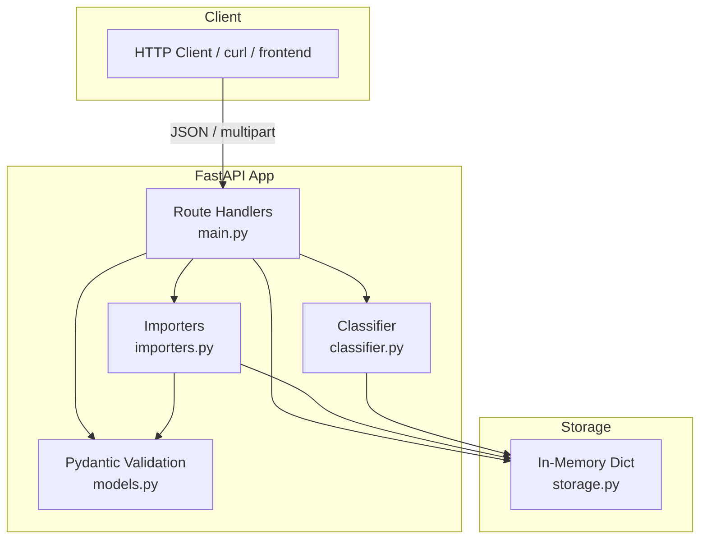
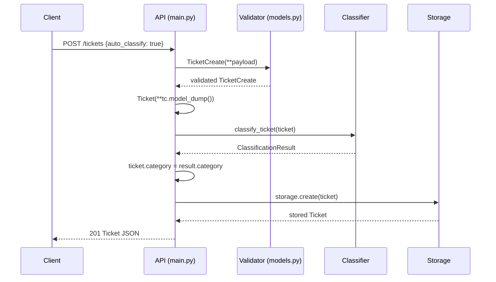
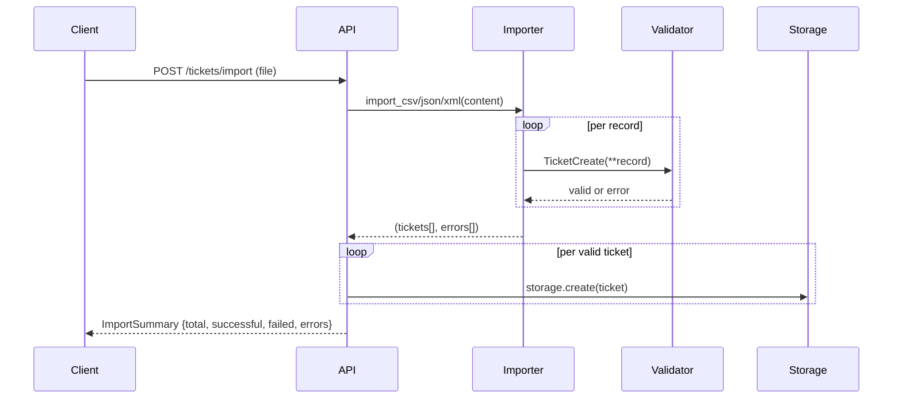

# Architecture

## High-Level Overview

## Component Descriptions

| Component | File | Responsibility |
|-----------|------|----------------|
| Route Handlers | `main.py` | HTTP routing, request parsing, response shaping |
| Models | `models.py` | Pydantic schemas, enum validation, field constraints |
| Storage | `storage.py` | In-memory dict CRUD, filtering |
| Classifier | `classifier.py` | Keyword-based category and priority scoring |
| Importers | `importers.py` | CSV / JSON / XML parsing into Ticket objects |

## Data Flow — Ticket Creation with Auto-Classify

## Data Flow — Bulk Import

## Design Decisions

| Decision | Chosen | Alternative | Reason |
|----------|--------|-------------|--------|
| Storage | In-memory dict | SQLite / PostgreSQL | Simplicity for HW; swap by replacing storage.py |
| Validation | Pydantic v2 | marshmallow | Native FastAPI integration, fast |
| Classification | Keyword rules | LLM / scikit-learn | Zero latency, no external dependencies, deterministic |
| Framework | FastAPI | Flask | Auto-docs, async support, Pydantic-native |

## Security Considerations

- Email validated via Pydantic `EmailStr` — prevents invalid data
- File size not bounded by the API (should add in production via nginx/reverse proxy)
- No authentication — add OAuth2/API keys for production
- XML parser uses `xml.etree.ElementTree` (safe, not vulnerable to XXE by default in Python)

## Performance Characteristics

- All storage operations are O(1) for create/get/delete, O(n) for list/filter
- Classification is O(k) where k = total keyword count (~60 keywords) — effectively constant
- CSV/JSON/XML parsing is O(n) per file
- 1000-ticket list operation completes in <2s (verified by performance tests)
