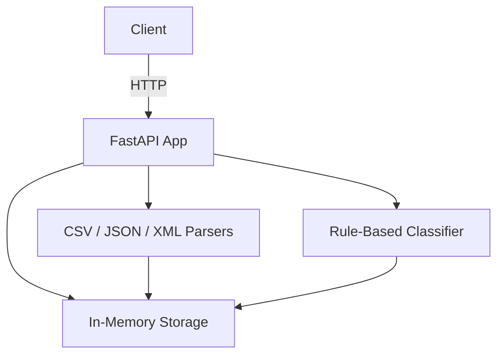

# Customer Support Ticket System

A REST API for managing customer support tickets with automatic categorisation and priority assignment.

## Features

- Full CRUD for tickets
- Bulk import from CSV, JSON, and XML
- Rule-based auto-classification (category + priority)
- Filtering by category, priority, status, assignee
- 97% test coverage across 57 tests

## Architecture



## Project Structure

```
homework-2/
├── src/
│   ├── main.py          # FastAPI app and all route handlers
│   ├── models.py        # Pydantic models and enums
│   ├── storage.py       # In-memory ticket store
│   ├── classifier.py    # Keyword-based auto-classification
│   ├── importers.py     # CSV/JSON/XML file parsers
│   └── requirements.txt
├── tests/
│   ├── conftest.py
│   ├── test_ticket_api.py       (11 tests)
│   ├── test_ticket_model.py     (9 tests)
│   ├── test_import_csv.py       (6 tests)
│   ├── test_import_json.py      (5 tests)
│   ├── test_import_xml.py       (5 tests)
│   ├── test_categorization.py   (11 tests)
│   ├── test_integration.py      (5 tests)
│   └── test_performance.py      (5 tests)
├── docs/
│   ├── README.md
│   ├── API_REFERENCE.md
│   ├── ARCHITECTURE.md
│   └── TESTING_GUIDE.md
├── sample_tickets.csv   (50 tickets)
├── sample_tickets.json  (20 tickets)
├── sample_tickets.xml   (30 tickets)
└── pytest.ini
```

## Setup

```bash
cd homework-2/src
pip install -r requirements.txt
```

## Run the API

```bash
cd homework-2/src
uvicorn main:app --reload --port 8000
```

Interactive docs available at `http://localhost:8000/docs`.

## Run Tests

```bash
cd homework-2
python -m pytest tests/ --cov=src --cov-config=pytest.ini --cov-report=term-missing
```

## Generate Sample Data

```bash
cd homework-2/src
python generate_samples.py
```
