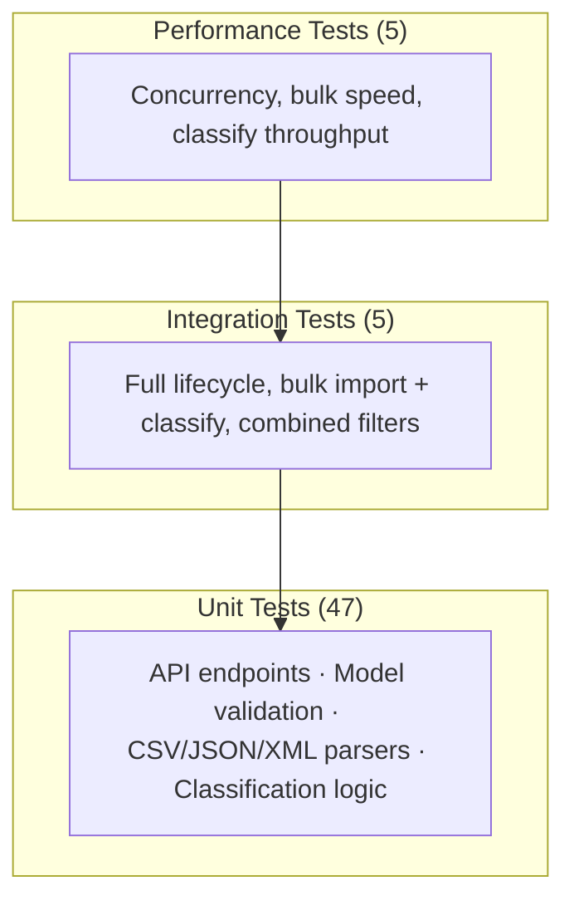

# Testing Guide

## Test Pyramid



## How to Run Tests

**All tests with coverage:**
```bash
cd homework-2
python -m pytest tests/ --cov=src --cov-config=pytest.ini --cov-report=term-missing
```

**Single file:**
```bash
python -m pytest tests/test_ticket_api.py -v
```

**HTML coverage report:**
```bash
python -m pytest tests/ --cov=src --cov-report=html:docs/coverage_html
# Open docs/coverage_html/index.html in a browser
```

## Test Files

| File | Scope | Count |
|------|-------|-------|
| `test_ticket_api.py` | API endpoints (CRUD + filters) | 11 |
| `test_ticket_model.py` | Pydantic validation | 9 |
| `test_import_csv.py` | CSV parsing | 6 |
| `test_import_json.py` | JSON parsing | 5 |
| `test_import_xml.py` | XML parsing | 5 |
| `test_categorization.py` | Classification + endpoint | 11 |
| `test_integration.py` | End-to-end scenarios | 5 |
| `test_performance.py` | Speed & concurrency | 5 |
| **Total** | | **57** |

## Sample Data Locations

| File | Records | Use |
|------|---------|-----|
| `sample_tickets.csv` | 50 | Bulk CSV import testing |
| `sample_tickets.json` | 20 | Bulk JSON import testing |
| `sample_tickets.xml` | 30 | Bulk XML import testing |
| `invalid_tickets.json` | 1 bad | Negative test: bad email |
| `invalid_tickets.csv` | 1 bad | Negative test: missing fields |
| `invalid_tickets.xml` | 1 bad | Negative test: missing fields |
| `malformed.json` | — | Negative test: invalid JSON |
| `malformed.xml` | — | Negative test: invalid XML |

## Manual Testing Checklist

- [ ] `POST /tickets` with valid payload → 201
- [ ] `POST /tickets` with bad email → 422
- [ ] `POST /tickets` with `auto_classify: true` → category and priority populated
- [ ] `GET /tickets?category=billing_question` → only billing tickets
- [ ] `PUT /tickets/{id}` status → `resolved` → `resolved_at` is set
- [ ] `DELETE /tickets/{id}` → 204, then GET → 404
- [ ] `POST /tickets/import` with `sample_tickets.csv` → summary with 50 successful
- [ ] `POST /tickets/import` with `malformed.json` → error message
- [ ] `POST /tickets/import` with `.txt` file → 400 Unsupported
- [ ] `POST /tickets/{id}/auto-classify` → returns category, priority, confidence, keywords

## Performance Benchmarks (from `test_performance.py`)

| Benchmark | Threshold | Result |
|-----------|-----------|--------|
| 100 sequential creates | < 10s | ~1.3s |
| 20 concurrent creates | 0 errors | Pass |
| Bulk import 50 JSON records | < 5s | ~0.2s |
| List 1000 tickets | < 2s | ~0.1s |
| 50 classify calls | < 3s | ~0.2s |

## Coverage Report

Overall: **97%** (328 statements, 11 missed)

| Module | Coverage |
|--------|----------|
| `classifier.py` | 100% |
| `models.py` | 100% |
| `importers.py` | 95% |
| `main.py` | 94% |
| `storage.py` | 94% |
