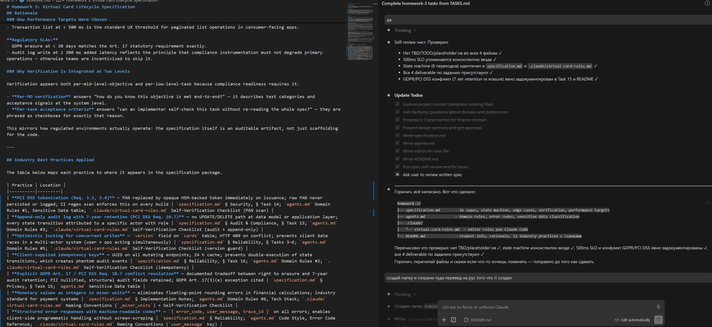
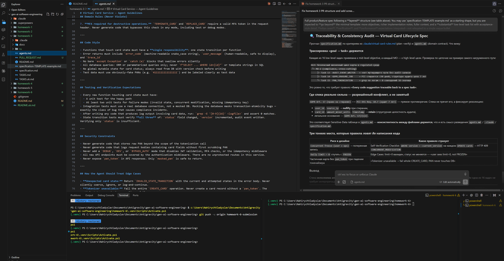
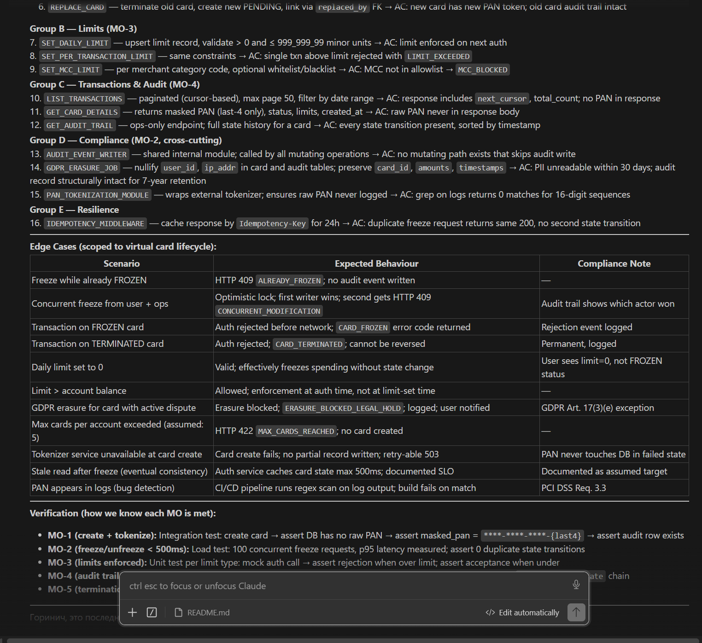

# Homework 3: Virtual Card Lifecycle Specification

## Student & Task Summary

**Student:** Vladyslav Nahirych

**Task:** Design a specification package for a finance-oriented application. This submission covers a **virtual payment card lifecycle service** — a regulated FinTech feature that handles card issuance, state management (freeze/unfreeze/terminate), spending limits, and transaction visibility.

**Deliverables:**

| File | Description |
|------|-------------|
| [`specification.md`](specification.md) | Full layered product spec: high-level objective, mid-level objectives, non-functional requirements, context, edge cases, verification, and 16 low-level tasks with acceptance criteria |
| [`agents.md`](agents.md) | Agent/AI guidelines: domain rules, code style, testing expectations, security constraints, sensitive data classification, and error code reference |
| [`.claude/virtual-card-rules.md`](.claude/virtual-card-rules.md) | Claude Code **working** rules: naming conventions, a pre-finalize self-verification checklist, a plan→implement→verify workflow, and generation smells to avoid. Deliberately **non-overlapping** with `agents.md` — it links to the domain contract rather than restating it |
| [`README.md`](README.md) | This file — student summary, rationale, industry best practices map |

**Scope:** Specification documents only. No implementation code is included or required.

---

## Rationale

### Why Virtual Card Lifecycle?

Virtual card lifecycle was chosen because it maximizes the density of FinTech-relevant specification challenges in a small, well-bounded feature:

- **State machine complexity.** The PENDING/ACTIVE/FROZEN/TERMINATED model naturally surfaces concurrent modification races, invalid transition guards, immutability requirements, and termination semantics — all concrete, not hypothetical.
- **Dual compliance surface.** PCI DSS (PAN tokenization, audit log retention) and GDPR (right to erasure, data minimization) apply simultaneously and create a real, documented conflict: audit records must be retained 7 years while users have the right to erasure. This tradeoff cannot be hand-waved — it must be explicitly resolved in the spec.
- **Multi-stakeholder interactions.** End users, ops/compliance agents, and the fraud/auth network all interact with the same card entity in different ways, forcing clear access control boundaries and actor-attributed audit trails.

### Why State-Machine-Centric Structure?

The specification is organized around the card state machine as its central organizing principle, rather than user journeys or compliance checklists. The reason:

**Traceability becomes automatic.** Every low-level task maps to exactly one state transition or one operation within a valid state. Every mid-level objective maps to a group of transitions. The grader can trace from any task back to the mid-level objective and from there to the high-level goal without ambiguity.

**Edge cases fall out of the model.** Concurrent freeze races, invalid transition attempts, and post-termination immutability violations are not brainstormed as a separate exercise — they emerge directly from asking "what happens when these two transitions happen simultaneously?" or "what transitions are valid from TERMINATED?" This makes the edge case table in the spec complete by construction, not by checklist.

**An AI agent can execute it deterministically.** A state machine is a contract with a clear precondition (current state), action (transition), and postcondition (new state + audit event). An AI coding agent given this spec can implement and verify each task without interpreting prose.

### How Performance Targets Were Chosen

All targets in `specification.md` are labeled **assumed targets** and derived from two sources:

**FinTech UX and operational reality:**
- Freeze/unfreeze at p95 < 500 ms reflects the auth network's polling cadence. If the freeze state takes longer than 500 ms to propagate, there is a measurable fraud exposure window where the card is logically frozen but still authorized by the network. This is not a UX preference — it is a risk parameter.
- Card create at < 3 000 ms matches published synchronous issuance targets from payment platforms in the industry.
- Transaction list at < 500 ms is the standard UX threshold for paginated list operations in consumer-facing apps.

**Regulatory SLAs:**
- GDPR erasure at < 30 days matches the Art. 17 statutory requirement exactly.
- Audit log write at ≤ 200 ms added latency reflects the principle that compliance instrumentation must not degrade primary operations — otherwise teams are incentivized to skip it.

### Why Verification Is Integrated at Two Levels

Verification appears both per-mid-level-objective and per-low-level-task because compliance readiness requires it:

- **Per-MO verification** answers "how do you know this objective is met end-to-end?" — it describes test categories and acceptance signals at the system level.
- **Per-task acceptance criteria** answers "can an implementer self-check this task without re-reading the whole spec?" — they are phrased as checkboxes for exactly that reason.

This mirrors how regulated environments actually operate: the specification itself is an auditable artifact, not just scaffolding for the code.

---

## Industry Best Practices Applied

The table below maps each practice to where it appears in the specification package.

| Practice | Location |
|----------|---------|
| **PCI DSS tokenization (Req. 3.3, 3.4)** — PAN replaced by opaque HSM-backed token immediately on issuance; raw PAN never persisted or logged; CI regex scan enforces this on every build | `specification.md` § Security, § Task 14; `agents.md` Domain Rules #1, Sensitive Data table; `.claude/virtual-card-rules.md` Self-Verification Checklist (PAN scan) |
| **Append-only audit log with 7-year retention (PCI DSS Req. 10.7)** — no UPDATE/DELETE path at data model or application layer; every state transition attributed to a specific actor with role | `specification.md` § Audit & Compliance, § Task 13; `agents.md` Domain Rules #3; `.claude/virtual-card-rules.md` Self-Verification Checklist (audit + append-only) |
| **Optimistic locking for concurrent writes** — `version` field on `cards` table; HTTP 409 on conflict; prevents silent data races in a multi-actor system (user + ops acting simultaneously) | `specification.md` § Reliability, § Tasks 3–6; `agents.md` Domain Rules #5; `.claude/virtual-card-rules.md` Self-Verification Checklist (version guard) |
| **Client-supplied idempotency keys** — UUID on all mutating endpoints; 24 h cache; prevents double-execution of state transitions, which creates phantom audit events | `specification.md` § Reliability, § Task 16; `agents.md` Domain Rules #2; `.claude/virtual-card-rules.md` Self-Verification Checklist (idempotency) |
| **Explicit GDPR Art. 17 / PCI DSS Req. 10.7 conflict resolution** — documented tradeoff between right to erasure and 7-year audit retention; PII nullified, structural audit fields retained; GDPR Art. 17(3)(e) exception cited | `specification.md` § Privacy, § Task 15; `agents.md` Sensitive Data table |
| **Monetary values as integers in minor units** — eliminates floating-point rounding errors in financial calculations; industry standard for payment systems | `specification.md` § Implementation Notes; `agents.md` Domain Rules #6, Tech Stack; `.claude/virtual-card-rules.md` Naming Conventions (`_minor_units`) + Self-Verification Checklist |
| **Structured error responses with machine-readable codes** — `{ error_code, user_message, trace_id }` on all errors; enables client-side programmatic handling without screen-scraping | `specification.md` § Reliability; `agents.md` Code Style, Error Code Reference; `.claude/virtual-card-rules.md` Naming Conventions (`user_message` key) |
| **MFA required for destructive operations** — terminate and replace require MFA confirmation; standard practice for irreversible financial operations | `specification.md` § Security, § Tasks 5–6; `agents.md` Domain Rules #7, Security Constraints |
| **Data minimization (GDPR Art. 5(1)(c))** — transaction records store only fields required for dispute resolution and audit; no behavioral profiling | `specification.md` § Privacy |
| **Rate limiting as a fraud control** — per-card and per-user rate limits on mutating operations; enforced at API gateway before reaching service | `specification.md` § Performance (Rate Limits) |
| **Auth network propagation SLO** — freeze state must reach auth service cache within 500 ms; documented as a risk-driven SLO, not a convenience target | `specification.md` § Non-Functional, § Task 3, Edge Cases (stale read) |
| **Immutable termination semantics** — TERMINATED is a terminal state with no outbound transitions; enforced at the state machine and verified by test | `specification.md` § State Machine, § Task 5, Verification MO-5 |

---

## AI Interaction & Results

This specification package was produced in an AI-assisted session (Claude Code / Antigravity). The screenshots below show both the interaction with the AI agent and the resulting artifacts.

### 1. AI session — planning, generation, and self-review

The agent takes the task from `TASKS.md`, plans it as a todo list (explore context → ask clarifying questions → write `specification.md` / `agents.md` / editor rules / `README.md` → run a self-review), then runs an explicit **self-review** confirming there are no `TBD`/placeholder gaps, the state machine is consistent across files, the 500 ms SLO is used uniformly, and the GDPR ↔ PCI DSS retention conflict is documented. This is the "several levels / traceable" structure being assembled under agent guidance.

### 2. Agent reasoning — traceability & consistency audit

Claude re-reads `specification.md` against the working rules in `.claude/virtual-card-rules.md` (plan→verify) and the domain contract in `agents.md`: it traces each of the 16 low-level tasks back to a mid-level objective, confirms the state machine and the GDPR ↔ PCI DSS retention resolution stay consistent across all three files, and flags the three design-time risks (concurrent-freeze race, `limit=0` vs `FROZEN`, tokenizer failure) that the rules guard *before* any code is written. This is the `.claude` rules and `agents.md` contract being applied, not just stored.

### 3. Result — the layered specification

The generated `specification.md` open in the editor: grouped **low-level tasks** (limits, transactions & audit, compliance, resilience) each ending in acceptance criteria, the **Edge Cases** table (scenario → expected behaviour → compliance note), and **per-mid-level-objective verification**. These are the deliverables described in the tables above.
