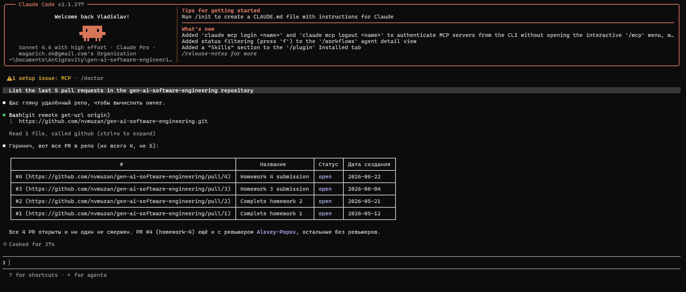
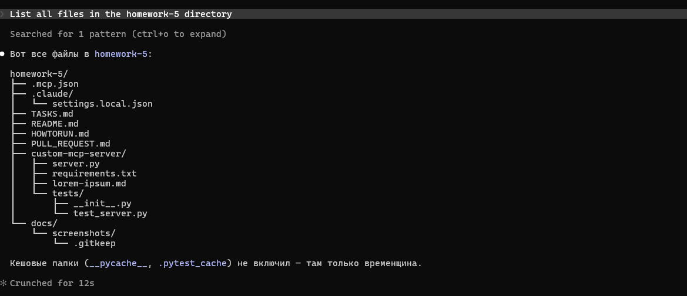
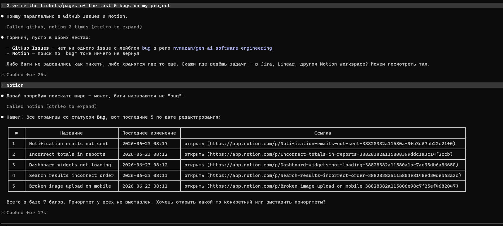
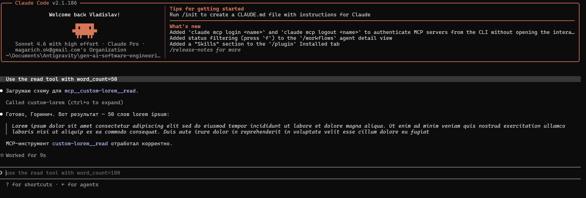

# Pull Request: Homework 5 — Configure MCP Servers

**Branch:** `homework-5-submission` → `main`
**Author:** Vladyslav Nahirych
**Date:** 2026-06-22

---

## Summary

Configured four MCP servers to extend Claude Code with external data sources and tools, and built one custom MCP server from scratch using FastMCP.

### Deliverables

| Deliverable | File | Status |
|---|---|---|
| MCP configuration | `homework-5/.mcp.json` | ✅ All 4 servers registered |
| Custom MCP server | `homework-5/custom-mcp-server/server.py` | ✅ Resource + `read` tool |
| Dependencies | `homework-5/custom-mcp-server/requirements.txt` | ✅ `fastmcp>=2.0.0` |
| Lorem ipsum source | `homework-5/custom-mcp-server/lorem-ipsum.md` | ✅ 200+ words |
| Unit tests | `homework-5/custom-mcp-server/tests/test_server.py` | ✅ 4 passed |
| Documentation | `homework-5/README.md`, `homework-5/HOWTORUN.md` | ✅ |
| Screenshots | `homework-5/docs/screenshots/` | 📸 See below |

### Configured MCP Servers

| Server | Package | Purpose |
|---|---|---|
| `github` | `@modelcontextprotocol/server-github` | List PRs, commits, issues in `gen-ai-software-engineering` |
| `filesystem` | `@modelcontextprotocol/server-filesystem` | Read access to `homework-5/` directory |
| `notion` | `@notionhq/notion-mcp-server` | Query Notion workspace for bug tickets |
| `custom-lorem` | `custom-mcp-server/server.py` (FastMCP) | Return N words from lorem ipsum via `read` tool |

### Custom Server API

| Type | Name | URI / Signature | Description |
|---|---|---|---|
| Resource | `lorem_resource` | `lorem://ipsum/{word_count}` | URI-addressable lorem ipsum slice |
| Tool | `read` | `read(word_count: int = 30) -> str` | Callable action returning N words |

---

## AI Tools Used

**Tool:** Claude Code (claude-sonnet-4-6)

### Workflow

1. Provided Claude Code with `TASKS.md` and went through a structured brainstorming session: context exploration → clarifying questions → approach proposals → section-by-section design review → approval before writing.
2. Chose **Notion** over Jira (both were options) — simpler API token setup, no corporate account required.
3. Chose **stdio transport** for the custom FastMCP server over HTTP/SSE — stdio is how all official MCP servers work (GitHub, Filesystem), requires no running process, and Claude Code manages the lifecycle automatically.
4. Applied TDD to the custom server's word-slice logic: tests written first, verified to fail, then `server.py` written to make them pass.
5. Design spec and implementation plan committed to `docs/superpowers/` before any code was written.

### What Was Verified

- `python -m pytest tests/ -v` → **4 passed** (`test_slice_words_default`, `test_slice_words_more_than_available`, `test_slice_words_zero`, `test_slice_words_single`)
- `python -c "import json; json.load(open('homework-5/.mcp.json'))"` → **JSON valid**
- `python -c "import server"` → **imports OK**, FastMCP instance initializes without errors
- Project structure matches `TASKS.md` expected layout

---

## Design Decisions

### stdio transport over HTTP/SSE for custom server

The task allowed any FastMCP transport. `stdio` was chosen because it matches how all three external MCP servers (GitHub, Filesystem, Notion) work — Claude Code spawns the process, connects via stdin/stdout, and shuts it down when done. No port management, no "start the server first" step in HOWTORUN, no risk of port conflicts. HTTP/SSE would have added complexity with no benefit for a single-client scenario.

### `slice_words` extracted as a pure function

The word-slice logic (`text.split()[:n]`) is used by both the Resource and the Tool. Extracting it as `slice_words(text, word_count) -> str` made it independently testable without importing FastMCP or touching the filesystem. This is also why the tests import `from server import slice_words` rather than going through the MCP layer.

### No secrets in `.mcp.json`

`GITHUB_PERSONAL_ACCESS_TOKEN` and `NOTION_API_KEY` are referenced as `${VAR}` environment variable placeholders. The actual values are set by the user at runtime — never committed. This follows the same pattern as the official MCP server documentation.

---

## Challenges Encountered

### fastmcp version conflict with starlette

`pip install fastmcp>=2.0.0` installed `fastmcp 3.4.2` alongside `starlette 1.3.1`, which conflicts with `fastapi 0.115.0`'s requirement of `starlette<0.39.0`. The warning appears at install time but does not affect the custom server because it uses stdio transport (no HTTP stack involved). The existing homework-2 FastAPI project is unaffected since it runs in its own virtual environment.

### Commits interleaved with homework-4 work

During implementation, homework-5 commits were made on `homework-4-submission` branch alongside homework-4 commits. Resolved by cherry-picking the six `feat(hw5):` commits onto a clean `homework-5-submission` branch created from `main`.

---

## Screenshots

Screenshots taken during live MCP interactions in Claude Code. Place in `docs/screenshots/` before submitting.

### GitHub MCP

**Prompt:** *"List the last 5 pull requests in the gen-ai-software-engineering repository."*



---

### Filesystem MCP

**Prompt:** *"List all files in the homework-5 directory."*



---

### Notion MCP

**Prompt:** *"Give me the tickets/pages of the last 5 bugs on my project."*



---

### Custom MCP — `read` tool

**Prompt:** *"Use the read tool with word_count=50"*



---

## Project Structure

```
homework-5/
├── README.md                           # Description + author
├── HOWTORUN.md                         # Prerequisites, setup, test prompts, Resources vs Tools
├── PULL_REQUEST.md                     # This file
├── .mcp.json                           # All 4 MCP servers (env var placeholders, no secrets)
├── custom-mcp-server/
│   ├── server.py                       # FastMCP server: lorem_resource + read tool
│   ├── lorem-ipsum.md                  # 200+ word lorem ipsum source
│   ├── requirements.txt               # fastmcp>=2.0.0
│   └── tests/
│       ├── __init__.py
│       └── test_server.py             # 4 unit tests for slice_words
└── docs/
    └── screenshots/
        ├── github-mcp-result.png
        ├── filesystem-mcp-result.png
        ├── notion-mcp-result.png
        └── custom-mcp-read-tool-result.png
```
